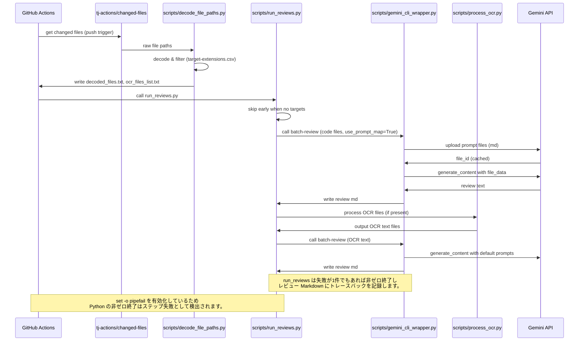

# Gemini Review Automation — フロー図

この資料は push トリガーのワークフロー `gemini-review.yml` を起点に、各 Python スクリプトがどのように協調するかを図解します。

## 図の見方
- ワークフローは GitHub Actions (`gemini-review.yml`) が起点です。
- `tj-actions/changed-files` → `scripts/decode_file_paths.py` → `scripts/run_reviews.py` → `scripts/gemini_cli_wrapper.py` の順に処理が進みます。
- `docs/target-extensions.csv` による拡張子マッピングは `decode_file_paths` と `gemini_cli_wrapper` で参照されます。

---

## Mermaid フローチャート (flowchart)

```mermaid
flowchart TD
  subgraph GH [GitHub Actions]
    A[gemini-review.yml]
    A -->|changed-files| B[tj-actions/changed-files]
    B --> C[scripts/decode_file_paths.py]
    C --> D(decoded_files.txt & ocr_files_list.txt)
    D --> E[scripts/run_reviews.py]
  end

  E --> F[scripts/gemini_cli_wrapper.py]
  E --> G[scripts/process_ocr.py]
  C --> H[docs/target-extensions.csv]
  F --> H

  H -->|拡張子->プロンプト| F
  F -->|upload prompt docs| I[Gemini API]
  I -->|review response| F
  F --> Output[review/yyyyMMdd/*.md]

   G --> OCRText[OCR テキストファイル]
   OCRText --> E

      %% decode_file_paths: path decoding, extension filter, route OCR candidates
      %% gemini_cli_wrapper: upload prompt md, reuse cached prompt IDs, call Gemini model, write error tracebacks to output md

### 補足

- **decode_file_paths**: path decoding, extension filter, route OCR candidates
- **gemini_cli_wrapper**: upload prompt md, reuse cached prompt IDs, call Gemini model, write error tracebacks to output md
```

---

## Mermaid シーケンス図 (sequence)
実行シーケンスを示します。



---

## 実装上の注意点 & 改善提案
1. プロンプトの重複アップロードを避ける
   - `gemini_cli_wrapper.py` は `uploaded_prompt_ids` マップを内部で作成していますが、`run_reviews.py` が二回呼ばれると同じ MD を再アップロードします。
   - 対策案: `run_reviews.py`で一度だけプロンプトをアップロードして File ID をキャッシュする、あるいは `gemini_cli_wrapper` に File ID キャッシュを保存するオプションを追加する。

2. 拡張子マッピングの優先度
   - CSV 設計により、複数の suffix（例: `.spec.ts`）を組み合わせた拡張子候補を `decode_file_paths` と `gemini_cli_wrapper` の双方で同じロジックで生成することを推奨します。現在は `gemini_cli_wrapper` 側で複数 suffix を扱っているので、`decode_file_paths` で同様に判定できれば一貫性が上がります。

3. ロギングとローカライズ
   - ユーザーの方針で、コード内コメントのみ日本語にし、実行時ログは英語のままにしているためテストログも英文のまま残ります（例: `Error: ...`）。

---

## 図のレンダリング方法
- GitHub 上で Markdown を表示すれば Mermaid がレンダリングされます。
- ローカルで確認する場合は VS Code の Mermaid Preview 拡張を利用してください。

---

上記の図と説明は `manual/review_system_design.md` の補足資料です。必要なら図の詳細化（各 CSV 行の例、API 呼び出しのサンプル）を追加します。